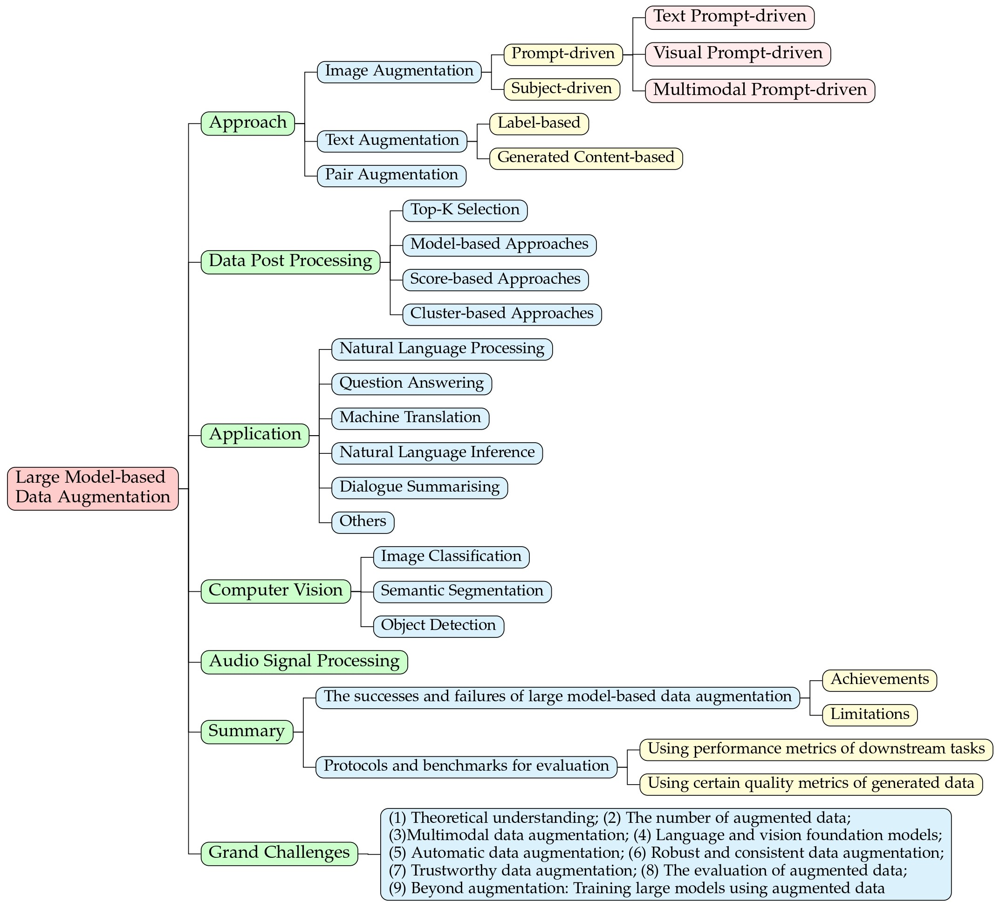

<h4 align="center">A Survey on Data Augmentation in Large Model Era</h4>
<!--<div align="center">
  <br>
  A collection of papers and resources related to evaluations on large language models.
</div>
<br>--!>

<p align="center">
  Yue Zhou<sup>*1</sup>&nbsp&nbsp
  Chenlu Guo<sup>*1</sup>&nbsp&nbsp
  Xu Wang<sup>1</sup>&nbsp&nbsp
  Yi Chang<sup>1</sup>&nbsp&nbsp
  Yuan Wu<sup>#1</sup>
</p>  

<p align="center">
<sup>1</sup> Jilin University<br>
(*: Co-first authors, #: Co-corresponding authors)
</p>

# Papers and resources on data augmentation using large models
The papers are organized according to our survey: [A Survey on Data Augmentation in Large Model Era](https://export.arxiv.org/abs/2401.15422).

**NOTE:** As real-time updates on the arXiv paper aren't possible, please refer to this repository for the latest information. We appreciate your contributions through pull requests or issue reports to enhance the survey, and your efforts will be acknowledged in ([acknowledgements](https://github.com/MLGroup-JLU/LLM-data-aug-survey/tree/main?tab=readme-ov-file#acknowledgements)).

Related projects:

- Evlauation of large language models: [[LLM-eval](https://llm-eval.github.io/)]
  


<details>
  <summary>Table of Contents</summary>
  <ol>
    <li><a href="#news-and-updates">News and Updates</a></li>
    <li>
      <a href="#Approaches">Approaches</a>
      <ul>
        <li><a href="#image-augmentation">Image Augmentation</a></li>
        <li><a href="#text-augmentation">Text Augmentation</a></li>
        <li><a href="#paired-augmentation">Paired Augmentation</a></li>
      </ul>
    </li>
<li><a href="#applications">Applications</a>
<ul>
    <li><a href="#natural-language-processing">Natural Language Processing</a></li>
<li><a href="#computer-vision">Computer Vision</a></li>
<li><a href="#audio-signal-processing">Audio signal processing</a></li>
</ul>
</li>
<li><a href="#data-post-processing">Data Post Processing</a>
<ul>
    <li><a href="#top-k-selectiong">Top-K Selection</a></li>
<li><a href="#model-based-approaches">Model-based Approaches</a></li>
<li><a href="#score-based-approaches">Score-based Approaches</a></li>
<li><a href="#cluster-based-approaches">Cluster-based Approaches</a></li>
</ul>
</i>
    <li><a href="#Contributing">Contributing</a></li>
    <li><a href="#citation">Citation</a></li>
    <li><a href="#acknowledgements">Acknowledgments</a></li>
  </ol>
</details>

## News and updates

* [01/27/2024] The first version of the paper is released on arXiv: [A Survey on Data Augmentation in Large Model Era](https://export.arxiv.org/abs/2401.15422).
  
## Approaches
### Image Augmentation
#### Prompt-driven approaches
***Text Prompt-driven***
1. Camdiff: Camouflage image augmentation via diffusion model. _Luo, X.-J. et al._ arKiv 2023. [[paper](https://arxiv.org/abs/2304.05469)]
2. Diffedit: Diffusion-based semantic image editing with mask guidance. _Couairon, G. et al._ arKiv 2022. [[paper](https://arxiv.org/abs/2210.11427)]
3. Glide: Towards photorealistic image generation and editing with text-guided diffusion models. _Nichol, A. et al._ arXiv 2021. [[paper](https://arxiv.org/abs/2112.10741)]
4. It is all about where you start: Text-to-image generation with seed selection. _Samuel, D. et al._ arXiv 2023. [[paper](https://arxiv.org/abs/2304.14530)]
5. Plug-and-play diffusion features for text-driven image-to-image translation. _Tumanyan, N. et al._ Proceedings of the IEEE/CVF Conference on Computer Vision and Pattern Recognition. [[paper](https://arxiv.org/abs/2211.12572)]
6. Prompt-to-prompt image editing with cross attention control. _Hertz, A. et al._ arXiv 2022. [[paper](https://arxiv.org/abs/2208.01626)]
7. Localizing Object-level Shape Variations with Text-to-Image Diffusion Models. _Patashnik, O. et al._ arXiv 2023. [[paper](https://arxiv.org/abs/2303.11306)]
8. Sine: Single image editing with text-to-image diffusion models. _Zhang, Z. et al._ Proceedings of the IEEE/CVF Conference on Computer Vision and Pattern Recognition. [[paper](https://arxiv.org/abs/2212.04489)]
9. Text2live: Text-driven layered image and video editing. _Bar-Tal, O. et al._ European conference on computer vision. [[paper](https://arxiv.org/abs/2204.02491)]
10. Diffusionclip: Text-guided diffusion models for robust image manipulation. _Kim, G. et al._ Proceedings of the IEEE/CVF Conference on Computer Vision and Pattern Recognition. [[paper](https://arxiv.org/abs/2110.02711)]
11. StyleGAN-NADA: CLIP-guided domain adaptation of image generators. _Gal, R. et al._ ACM Transactions on Graphics (TOG). [[paper](https://arxiv.org/abs/2108.00946)]
12. Diversify your vision datasets with automatic diffusion-based augmentation. _Dunlap, L. et al._ arXiv 2023. [[paper](https://arxiv.org/abs/2305.16289)]
13. Effective data augmentation with diffusion models. _Trabucco, B. et al._ arXiv 2023. [[paper](https://arxiv.org/abs/2302.07944)]
14. Imagic: Text-based real image editing with diffusion models. _Kawar, B. et al._ Proceedings of the IEEE/CVF Conference on Computer Vision and Pattern Recognition. [[paper](https://openaccess.thecvf.com/content/CVPR2023/html/Kawar_Imagic_Text-Based_Real_Image_Editing_With_Diffusion_Models_CVPR_2023_paper.html)]
15. TTIDA: Controllable Generative Data Augmentation via Text-to-Text and Text-to-Image Models. _Yin, Y. et al._ arXiv 2023. [[paper](https://arxiv.org/abs/2304.08821)]
16. Blended diffusion for text-driven editing of natural images. _Avrahami, O. et al._ Proceedings of the IEEE/CVF Conference on Computer Vision and Pattern Recognition. [[paper](https://arxiv.org/abs/2111.14818)]
17. Dynamic Prompt Learning: Addressing Cross-Attention Leakage for Text-Based Image Editing. _Wang, K. et al._ arXiv 2023. [[paper](https://arxiv.org/abs/2309.15664)]
18. Instructpix2pix: Learning to follow image editing instructions. _Brooks, T. et al._ Proceedings of the IEEE/CVF Conference on Computer Vision and Pattern Recognition. [[paper](https://arxiv.org/abs/2211.09800)]
19. Expressive text-to-image generation with rich text. _Ge, S. et al._ Proceedings of the IEEE/CVF International Conference on Computer Vision. [[paper](https://openaccess.thecvf.com/content/ICCV2023/html/Ge_Expressive_Text-to-Image_Generation_with_Rich_Text_ICCV_2023_paper.html)]
20. GeNIe: Generative Hard Negative Images Through Diffusion. _Koohpayegani, S. et al._ arXiv 2023. [[paper](https://arxiv.org/abs/2312.02548)]
21. Semantic Generative Augmentations for Few-Shot Counting. _Doubinsky, P. et al._ arXiv 2023. [[paper](https://arxiv.org/abs/2311.16122)]

***Visual Prompt-driven***
1. ImageBrush: Learning Visual In-Context Instructions for Exemplar-Based Image Manipulation. _Sun, Y. et al._ arXiv 2023. [[paper](https://arxiv.org/abs/2308.00906)]
2. Diffusion-based data augmentation for nuclei image segmentation. _Yu, X. et al._ International Conference on Medical Image Computing and Computer-Assisted Intervention. [[paper](https://arxiv.org/abs/2310.14197)]
3. Image Augmentation with Controlled Diffusion for Weakly-Supervised Semantic Segmentation. _Wu, W. et al._ arXiv 2023. [[paper](https://arxiv.org/abs/2310.09760)]
4. More control for free! image synthesis with semantic diffusion guidance. _Liu, X. et al._ Proceedings of the IEEE/CVF Winter Conference on Applications of Computer Vision. [[paper](https://arxiv.org/abs/2112.05744)]
   

***Multimodal Prompt-driven***
1. Visual instruction inversion: Image editing via visual prompting. _Nguyen, T. et al._ arXiv 2023. [[paper](https://arxiv.org/abs/2307.14331)]
2. In-context learning unlocked for diffusion models. _Wang, Z. et al._ arXiv 2023. [[paper](https://arxiv.org/abs/2305.01115)]
3. Smartbrush: Text and shape guided object inpainting with diffusion model. _Xie, S. et al._ Proceedings of the IEEE/CVF Conference on Computer Vision and Pattern Recognition. [[paper](https://openaccess.thecvf.com/content/CVPR2023/html/Xie_SmartBrush_Text_and_Shape_Guided_Object_Inpainting_With_Diffusion_Model_CVPR_2023_paper.html)]
4. ReVersion: Diffusion-Based Relation Inversion from Images. _Huang, Z. et al._ arXiv 2023. [[paper](https://arxiv.org/abs/2303.13495)]
5. Gligen: Open-set grounded text-to-image generation. _Li, Y. et al._ Proceedings of the IEEE/CVF Conference on Computer Vision and Pattern Recognition. [[paper](https://openaccess.thecvf.com/content/CVPR2023/html/Li_GLIGEN_Open-Set_Grounded_Text-to-Image_Generation_CVPR_2023_paper.html)]
6. Adding conditional control to text-to-image diffusion models. _Zhang, L. et al._ Proceedings of the IEEE/CVF International Conference on Computer Vision. [[paper](https://arxiv.org/abs/2302.05543)]
7. Boosting Dermatoscopic Lesion Segmentation via Diffusion Models with Visual and Textual Prompts. _Du, S. et al._ arXiv 2023. [[paper](https://arxiv.org/abs/2310.02906)]
8. Generative Data Augmentation Improves Scribble-supervised Semantic Segmentation. _Schnell, J. et al._ arXiv 2023. [[paper](https://arxiv.org/abs/2311.17121)]


#### Subject-driven approaches
1. An image is worth one word: Personalizing text-to-image generation using textual inversion. _Gal, R. et al._ arXiv 2022. [[paper](https://arxiv.org/abs/2208.01618)]
2. Dreambooth: Fine tuning text-to-image diffusion models for subject-driven generation. _Ruiz, N. et al._ Proceedings of the IEEE/CVF Conference on Computer Vision and Pattern Recognition. [[paper](https://arxiv.org/abs/2208.12242)]
3. Instantbooth: Personalized text-to-image generation without test-time finetuning. _Shi, J. et al._ arXiv 2023. [[paper](https://arxiv.org/abs/2304.03411)]
4. Unified multi-modal latent diffusion for joint subject and text conditional image generation. _Ma, Y. et al._ arXiv 2023. [[paper](https://arxiv.org/abs/2303.09319)]
5. Multi-concept customization of text-to-image diffusion. _Kumari, N. et al._ Proceedings of the IEEE/CVF Conference on Computer Vision and Pattern Recognition. [[paper](https://arxiv.org/abs/2212.04488)]
6. Blip-diffusion: Pre-trained subject representation for controllable text-to-image generation and editing. _Li, D. et al._ arXiv 2023. [[paper](https://arxiv.org/abs/2305.14720)]
7. FastComposer: Tuning-Free Multi-Subject Image Generation with Localized Attention. _Xiao, G. et al._ arXiv 2023. [[paper](https://arxiv.org/abs/2305.10431)]
8. Elite: Encoding visual concepts into textual embeddings for customized text-to-image generation. _Wei, Y. et al._ arXiv 2023. [[paper](https://arxiv.org/abs/2302.13848)]
9. Subject-driven text-to-image generation via apprenticeship learning. _Chen, W. et al._ arXiv 2023. [[paper](https://arxiv.org/abs/2304.00186)]


### Text Augmentation

#### Label-based approaches
1. Augmented sbert: Data augmentation method for improving bi-encoders for pairwise sentence scoring tasks. _Thakur, N. et al._ arXiv 2020. [[paper](https://arxiv.org/abs/2010.08240)]
2. Data augmentation using pre-trained transformer models. _Kumar, V. et al._ arXiv 2020. [[paper](https://arxiv.org/abs/2003.02245)]
3. Data augmentation for intent classification with off-the-shelf large language models. _Sahu, G. et al._ arXiv 2022. [[paper](https://arxiv.org/abs/2204.01959)]
4. GPT3Mix: Leveraging large-scale language models for text augmentation. _Yoo, K. et al._ arXiv 2021. [[paper](https://arxiv.org/abs/2104.08826)]
5. Augmenting text for spoken language understanding with Large Language Models. _Sharma, R. et al._ arXiv 2023. [[paper](https://arxiv.org/abs/2309.09390)]
6. Can LLMs Augment Low-Resource Reading Comprehension Datasets? Opportunities and Challenges. _Samuel, V. et al._ arXiv 2023. [[paper](https://arxiv.org/abs/2309.12426)]
7. Can large language models aid in annotating speech emotional data? uncovering new frontiers. _Latif, S. et al._ arXiv 2023. [[paper](https://arxiv.org/abs/2307.06090)]
8. Generative Data Augmentation using LLMs improves Distributional Robustness in Question Answering. _Chowdhury, A. et al._ arXiv 2023. [[paper](https://arxiv.org/abs/2309.06358)]
9. MinPrompt: Graph-based Minimal Prompt Data Augmentation for Few-shot Question Answering. _Chen, X. et al._ arXiv 2023. [[paper](https://arxiv.org/abs/2310.05007)]
10. Text Data Augmentation in Low-Resource Settings via Fine-Tuning of Large Language Models. _Kaddour, J. et al._ arXiv 2023. [[paper](https://arxiv.org/abs/2310.01119)]
11. Improving Audio Captioning Models with Fine-grained Audio Features, Text Embedding Supervision, and LLM Mix-up Augmentation. _Wu, S. et al._ arXiv 2023. [[paper](https://arxiv.org/abs/2309.17352)]

#### Generated content-based approaches
1. Augesc: Dialogue augmentation with large language models for emotional support conversation. _Zheng, C. et al._ Findings of the Association for Computational Linguistics: ACL 2023. [[paper](https://arxiv.org/abs/2202.13047)]
2. Chataug: Leveraging chatgpt for text data augmentation. _Dai, H. et al._ arXiv 2023. [[paper](https://arxiv.org/abs/2302.13007)]
3. Coca: Contrastive captioners are image-text foundation models. _Yu, J. et al._ arXiv 2022. [[paper](https://arxiv.org/abs/2205.01917)]
4. DAGAM: Data Augmentation with Generation And Modification. _Jo, B. et al._ arXiv 2022. [[paper](https://arxiv.org/abs/2204.02633)]
5. Data augmentation for neural machine translation using generative language model. _Oh, S. et al._ arXiv 2023. [[paper](https://arxiv.org/abs/2307.16833)]
6. Deep Transformer based Data Augmentation with Subword Units for Morphologically Rich Online ASR. _Tarj{\'a}n, B. et al._ arXiv 2020. [[paper](https://arxiv.org/abs/2007.06949)]
7. Flipda: Effective and robust data augmentation for few-shot learning. _Zhou, J. et al._ arXiv 2021. [[paper](https://arxiv.org/abs/2108.06332)]
8. Genius: Sketch-based language model pre-training via extreme and selective masking for text generation and augmentation. _Guo, B. et al._ arXiv 2022. [[paper](https://arxiv.org/abs/2211.10330)]
9. Inpars: Data augmentation for information retrieval using large language models. _Bonifacio, L. et al._ arXiv 2022. [[paper](https://arxiv.org/abs/2202.05144)]
10. SkillBot: Towards Data Augmentation using Transformer language model and linguistic evaluation. _Khatri, S. et al._ 2022 Human-Centered Cognitive Systems (HCCS). [[paper](https://ieeexplore.ieee.org/abstract/document/10090376)]
11. Textual data augmentation for efficient active learning on tiny datasets. _Quteineh, H. et al._ Proceedings of the 2020 Conference on Empirical Methods in Natural Language Processing (EMNLP). [[paper](https://aclanthology.org/2020.emnlp-main.600/)]
12. Wanli: Worker and ai collaboration for natural language inference dataset creation. _Liu, A. et al._ arXiv 2022. [[paper](https://arxiv.org/abs/2201.05955)]
13. EPA: Easy Prompt Augmentation on Large Language Models via Multiple Sources and Multiple Targets. _Lu, H. et al._ arXiv 2023. [[paper](https://arxiv.org/abs/2309.04725)]
14. Tuning language models as training data generators for augmentation-enhanced few-shot learning. _Meng, Y. et al._ International Conference on Machine Learning. [[paper](https://arxiv.org/abs/2211.03044)]
15. Generating training data with language models: Towards zero-shot language understanding. _Meng, Y. et al._ Advances in Neural Information Processing Systems. [[paper](https://arxiv.org/abs/2202.04538)]
16. ICLEF: In-Context Learning with Expert Feedback for Explainable Style Transfer. _Saakyan, A. et al._ arXiv 2023. [[paper](https://arxiv.org/abs/2309.08583)]
17. Natural Language Dataset Generation Framework for Visualizations Powered by Large Language Models. _Ko, H. et al._ arXiv 2023. [[paper](https://arxiv.org/abs/2309.10245)]
18. PULSAR at MEDIQA-Sum 2023: Large Language Models Augmented by Synthetic Dialogue Convert Patient Dialogues to Medical Records. _Schlegel, V. et al._ arXiv 2023. [[paper](https://arxiv.org/abs/2307.02006)]
19. Self-Guided Noise-Free Data Generation for Efficient Zero-Shot Learning. _Gao, J. et al._ The Eleventh International Conference on Learning Representations. [[paper](https://arxiv.org/abs/2205.12679)]
20. Resolving the Imbalance Issue in Hierarchical Disciplinary Topic Inference via LLM-based Data Augmentation. _Cai, X. et al._ arXiv 2023. [[paper](https://arxiv.org/abs/2310.05318)]
21. Just-in-Time Security Patch Detection--LLM At the Rescue for Data Augmentation. _Tang, X. et al._ arXiv 2023. [[paper](https://arxiv.org/abs/2312.01241)]
22. DAIL: Data Augmentation for In-Context Learning via Self-Paraphrase. _Li, D. et al._ arXiv 2023. [[paper](https://arxiv.org/abs/2311.03319)]
23. ZeroShotDataAug: Generating and Augmenting Training Data with ChatGPT. _Ubani, S. et al._ arXiv 2023. [[paper](https://arxiv.org/abs/2304.14334)]

### Paired Augmentation
1. Mixgen: A new multi-modal data augmentation. _Hao, X. et al._ Proceedings of the IEEE/CVF Winter Conference on Applications of Computer Vision. [[paper](https://arxiv.org/abs/2206.08358)]
2. PromptMix: Text-to-image diffusion models enhance the performance of lightweight networks. _Bakhtiarnia, A. et al._ arXiv 2023. [[paper](https://arxiv.org/abs/2301.12914)]
3. Towards reporting bias in visual-language datasets: bimodal augmentation by decoupling object-attribute association. _Wu, Q. et al._ arXiv 2023. [[paper](https://arxiv.org/abs/2310.01330)]

## Applications
### Natural Language Processing
#### Text classification
1. Chataug: Leveraging chatgpt for text data augmentation. _Dai, H. et al._ arXiv 2023. [[paper](https://arxiv.org/abs/2302.13007)]
2. DAGAM: Data Augmentation with Generation And Modification. _Jo, B. et al._ arXiv 2022. [[paper](https://arxiv.org/abs/2204.02633)]
3. Data augmentation using pre-trained transformer models. _Kumar, V. et al._ arXiv 2020. [[paper](https://arxiv.org/abs/2003.02245)]
4. Self-Guided Noise-Free Data Generation for Efficient Zero-Shot Learning. _Gao, J. et al._ The Eleventh International Conference on Learning Representations. [[paper](https://arxiv.org/abs/2205.12679)]
5. Resolving the Imbalance Issue in Hierarchical Disciplinary Topic Inference via LLM-based Data Augmentation. _Cai, X. et al._ arXiv 2023. [[paper](https://arxiv.org/abs/2310.05318)]
6. Genius: Sketch-based language model pre-training via extreme and selective masking for text generation and augmentation. _Guo, B. et al._ arXiv 2022. [[paper](https://arxiv.org/abs/2211.10330)]
7. Tuning language models as training data generators for augmentation-enhanced few-shot learning. _Meng, Y. et al._ International Conference on Machine Learning. [[paper](https://arxiv.org/abs/2211.03044)]
8. ICLEF: In-Context Learning with Expert Feedback for Explainable Style Transfer. _Saakyan, A. et al._ arXiv 2023. [[paper](https://arxiv.org/abs/2309.08583)]
9. DAIL: Data Augmentation for In-Context Learning via Self-Paraphrase. _Li, D. et al._ arXiv 2023. [[paper](https://arxiv.org/abs/2311.03319)]
#### Question answering
1. MinPrompt: Graph-based Minimal Prompt Data Augmentation for Few-shot Question Answering. _Chen, X. et al._ arXiv 2023. [[paper](https://arxiv.org/abs/2310.05007)]
2. Generative Data Augmentation using LLMs improves Distributional Robustness in Question Answering. _Chowdhury, A. et al._ arXiv 2023. [[paper](https://arxiv.org/abs/2309.06358)]
3. Can LLMs Augment Low-Resource Reading Comprehension Datasets? Opportunities and Challenges. _Samuel, V. et al._ arXiv 2023. [[paper](https://arxiv.org/abs/2309.12426)]
4. CATfOOD: Counterfactual Augmented Training for Improving Out-of-Domain Performance and Calibration. _Sachdeva, R. et al._ arXiv 2023. [[paper](https://arxiv.org/abs/2309.07822)]
   
#### Machine translation
1. EPA: Easy Prompt Augmentation on Large Language Models via Multiple Sources and Multiple Targets. _Lu, H. et al._ arXiv 2023. [[paper](https://arxiv.org/abs/2309.04725)]


#### Natural language inference
1. EPA: Easy Prompt Augmentation on Large Language Models via Multiple Sources and Multiple Targets. _Lu, H. et al._ arXiv 2023. [[paper](https://arxiv.org/abs/2309.04725)]
2. Wanli: Worker and ai collaboration for natural language inference dataset creation. _Liu, A. et al._ arXiv 2022. [[paper](https://arxiv.org/abs/2201.05955)]

#### Dialogue summarising
1. EPA: Easy Prompt Augmentation on Large Language Models via Multiple Sources and Multiple Targets. _Lu, H. et al._ arXiv 2023. [[paper](https://arxiv.org/abs/2309.04725)]
2. PULSAR at MEDIQA-Sum 2023: Large Language Models Augmented by Synthetic Dialogue Convert Patient Dialogues to Medical Records. _Schlegel, V. et al._ arXiv 2023. [[paper](https://arxiv.org/abs/2307.02006)]

#### Others
1. Augesc: Dialogue augmentation with large language models for emotional support conversation. _Zheng, C. et al._ Findings of the Association for Computational Linguistics: ACL 2023. [[paper](https://arxiv.org/abs/2202.13047)]
2. Augmented sbert: Data augmentation method for improving bi-encoders for pairwise sentence scoring tasks. _Thakur, N. et al._ arXiv 2020. [[paper](https://arxiv.org/abs/2010.08240)]
3. Inpars: Data augmentation for information retrieval using large language models. _Bonifacio, L. et al._ arXiv 2022. [[paper](https://arxiv.org/abs/2202.05144)]
4. EPA: Easy Prompt Augmentation on Large Language Models via Multiple Sources and Multiple Targets. _Lu, H. et al._ arXiv 2023. [[paper](https://arxiv.org/abs/2309.04725)]

### Computer Vision
#### Image classification
1. It is all about where you start: Text-to-image generation with seed selection. _Samuel, D. et al._ arXiv 2023. [[paper](https://arxiv.org/abs/2304.14530)]
2. Diversify your vision datasets with automatic diffusion-based augmentation. _Dunlap, L. et al._ arXiv 2023. [[paper](https://arxiv.org/abs/2305.16289)]
3. Effective data augmentation with diffusion models. _Trabucco, B. et al._ arXiv 2023. [[paper](https://arxiv.org/abs/2302.07944)]
4. TTIDA: Controllable Generative Data Augmentation via Text-to-Text and Text-to-Image Models. _Yin, Y. et al._ arXiv 2023. [[paper](https://arxiv.org/abs/2304.08821)]
5. Boosting Unsupervised Contrastive Learning Using Diffusion-Based Data Augmentation From Scratch. _Zang, Z. et al._ arXiv 2023. [[paper](https://arxiv.org/abs/2309.07909)]
6. GeNIe: Generative Hard Negative Images Through Diffusion. _Koohpayegani, S. et al._ arXiv 2023. [[paper](https://arxiv.org/abs/2312.02548)]

#### Semantic segmentation
1. EMIT-Diff: Enhancing Medical Image Segmentation via Text-Guided Diffusion Model. _Zhang, Z. et al._ arXiv 2023. [[paper](https://arxiv.org/abs/2310.12868)]
2. Boosting Dermatoscopic Lesion Segmentation via Diffusion Models with Visual and Textual Prompts. _Du, S. et al._ arXiv 2023. [[paper](https://arxiv.org/abs/2310.02906)]
3. Diffusion-based data augmentation for nuclei image segmentation. _Yu, X. et al._ International Conference on Medical Image Computing and Computer-Assisted Intervention. [[paper](https://arxiv.org/abs/2310.14197)]
4. Image Augmentation with Controlled Diffusion for Weakly-Supervised Semantic Segmentation. _Wu, W. et al._ arXiv 2023. [[paper](https://arxiv.org/abs/2310.09760)]
5. Generative Data Augmentation Improves Scribble-supervised Semantic Segmentation. _Schnell, J. et al._ arXiv 2023. [[paper](https://arxiv.org/abs/2311.17121)]

#### Object detection
1. The Big Data Myth: Using Diffusion Models for Dataset Generation to Train Deep Detection Models. _Voetman, R. et al._ arXiv 2023. [[paper](https://arxiv.org/abs/2306.09762)]
2. WoVoGen: World Volume-aware Diffusion for Controllable Multi-camera Driving Scene Generation. _Lu, J. et al._ arXiv 2023. [[paper](https://arxiv.org/abs/2312.02934)]

### Audio signal processing
1. Improving Audio Captioning Models with Fine-grained Audio Features, Text Embedding Supervision, and LLM Mix-up Augmentation. _Wu, S. et al._ arXiv 2023. [[paper](https://arxiv.org/abs/2309.17352)]
2. Augmenting text for spoken language understanding with Large Language Models. _Sharma, R. et al._ arXiv 2023. [[paper](https://arxiv.org/abs/2309.09390)]
3. Can large language models aid in annotating speech emotional data? uncovering new frontiers. _Latif, S. et al._ arXiv 2023. [[paper](https://arxiv.org/abs/2307.06090)]
4. Deep Transformer based Data Augmentation with Subword Units for Morphologically Rich Online ASR. _Tarj{\'a}n, B. et al._ arXiv 2020. [[paper](https://arxiv.org/abs/2007.06949)]
5. Adversarial Fine-tuning using Generated Respiratory Sound to Address Class Imbalance. _Kim, J. et al._ arXiv 2023. [[paper](https://arxiv.org/abs/2311.06480)]

## Data Post Processing

### Top-K Selection
1. Inpars: Data augmentation for information retrieval using large language models. _Bonifacio, L. et al._ arXiv 2022. [[paper](https://arxiv.org/abs/2202.05144)]
2. Generating training data with language models: Towards zero-shot language understanding. _Meng, Y. et al._ Advances in Neural Information Processing Systems. [[paper](https://arxiv.org/abs/2202.04538)]
3. Strata: Self-training with task augmentation for better few-shot learning. _Vu, T. et al._ arXiv 2021. [[paper](https://arxiv.org/abs/2109.06270)]


### Model-based Approaches
1. CATfOOD: Counterfactual Augmented Training for Improving Out-of-Domain Performance and Calibration. _Sachdeva, R. et al._ arXiv 2023. [[paper](https://arxiv.org/abs/2309.07822)]
2. Can LLMs Augment Low-Resource Reading Comprehension Datasets? Opportunities and Challenges. _Samuel, V. et al._ arXiv 2023. [[paper](https://arxiv.org/abs/2309.12426)]
3. Augmenting text for spoken language understanding with Large Language Models. _Sharma, R. et al._ arXiv 2023. [[paper](https://arxiv.org/abs/2309.09390)]
4. Data augmentation for intent classification with off-the-shelf large language models. _Sahu, G. et al._ arXiv 2022. [[paper](https://arxiv.org/abs/2204.01959)]
5. Flipda: Effective and robust data augmentation for few-shot learning. _Zhou, J. et al._ arXiv 2021. [[paper](https://arxiv.org/abs/2108.06332)]
6. Improving Audio Captioning Models with Fine-grained Audio Features, Text Embedding Supervision, and LLM Mix-up Augmentation. _Wu, S. et al._ arXiv 2023. [[paper](https://arxiv.org/abs/2309.17352)]

### Score-based Approaches
1. DiffuseExpand: Expanding dataset for 2D medical image segmentation using diffusion models. _Shao, S. et al._ arXiv 2023. [[paper](https://arxiv.org/abs/2304.13416)]
2. Image Augmentation with Controlled Diffusion for Weakly-Supervised Semantic Segmentation. _Wu, W. et al._ arXiv 2023. [[paper](https://arxiv.org/abs/2310.09760)]
3. Generative Data Augmentation using LLMs improves Distributional Robustness in Question Answering. _Chowdhury, A. et al._ arXiv 2023. [[paper](https://arxiv.org/abs/2309.06358)]
4. Augesc: Dialogue augmentation with large language models for emotional support conversation. _Zheng, C. et al._ Findings of the Association for Computational Linguistics: ACL 2023. [[paper](https://arxiv.org/abs/2202.13047)]
5. Wanli: Worker and ai collaboration for natural language inference dataset creation. _Liu, A. et al._ arXiv 2022. [[paper](https://arxiv.org/abs/2201.05955)]

### Cluster-based Approaches
1. Diffusion-based data augmentation for nuclei image segmentation. _Yu, X. et al._ International Conference on Medical Image Computing and Computer-Assisted Intervention. [[paper](https://arxiv.org/abs/2310.14197)]

## Contributing

We welcome contributions to LLM-data-aug-survey! If you'd like to contribute, please follow these steps:

1. Fork the repository.
2. Create a new branch incorporating your modifications.
3. Submit a pull request accompanied by a clear description of the changes you made.

Feel free to open an issue if you have any additions or comments.

## Citation

If you find this project useful in your research or work, please consider citing it:

```
@misc{zhou2024survey,
    title={A Survey on Data Augmentation in Large Model Era},
    author={Yue Zhou and Chenlu Guo and Xu Wang and Yi Chang and Yuan Wu},
    year={2024},
    eprint={2401.15422},
    archivePrefix={arXiv},
    primaryClass={cs.LG}
}
```

## Acknowledgements
